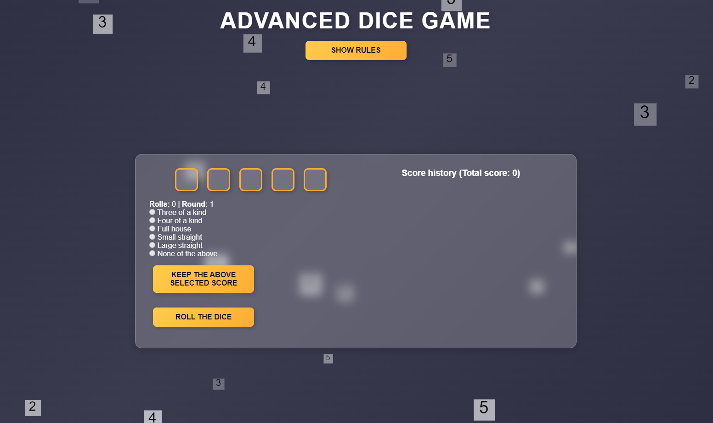

# 🎲 Advanced Dice Game - A Stylish & Interactive Experience

Welcome to the **Advanced Dice Game**, where sleek design meets interactive gameplay! This project isn't just a simple dice roller—it's a polished, animated experience showcasing my skills in modern web development. If you're a recruiter looking for someone who blends technical expertise with UI/UX finesse, you're in the right place. 😉

## 📸 Preview

![Game Screenshot]

## 🚀 Features

✨ **Glassmorphism UI** – A futuristic, frosted-glass aesthetic that feels premium.  
🎨 **Smooth Animations** – Engaging dice rolling effects for a fun, interactive experience.  
🎲 **Custom Dice Mechanics** – Multiple dice types, fair randomization, and dynamic interactions.  
🌗 **Dark & Light Mode** – A theme switcher for an enhanced user experience.  
📊 **Statistics & Game Tracking** – Tracks results, giving insights into rolls and probabilities.  
📱 **Fully Responsive** – Looks amazing on all screen sizes, from mobile to desktop.  

## 🛠️ Technologies Used

- **HTML5** – Semantic structure & accessibility in mind.
- **CSS3 (including Glassmorphism & Animations)** – Crafted for a modern aesthetic.
- **JavaScript (ES6+)** – Handles game logic, interactivity, and animations.

## 🎮 How to Play

1. Open the game in your browser.
2. Select the number of dice you want to roll.
3. Click the **Roll** button and watch the magic happen! 🎲
4. View results, track stats, and challenge yourself.

## 🤝 Why This Project?
This isn't just a dice game—it's a demonstration of:
- My ability to create **engaging, polished user experiences**.
- Writing **clean, modular, and maintainable JavaScript code**.
- Implementing **modern UI/UX principles** with animations and responsiveness.

## 🏗️ Future Enhancements

- 🔥 **Multiplayer Mode** – Play against a friend.
- 🤖 **AI Opponent** – Battle against an AI-driven player.
- 🏆 **Leaderboards** – Track high scores and game history.

### 📝 Recruiters: Looking for a frontend developer who can bring creativity and performance to the table? Let’s talk! 💼

## 📩 Contact Me
📧 Email: mduduzindlovu02@gmail.com  
💼 LinkedIn: [Your LinkedIn]("https://www.linkedin.com/in/mduduzi-ndlovu/")  
🌐 Portfolio: [Your Portfolio](your-portfolio-url)

